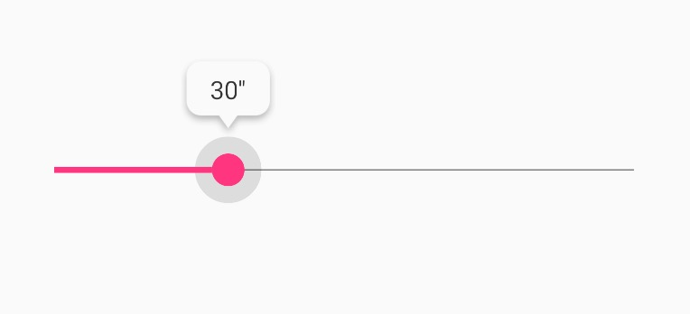

# SeekBarBubble
[](http://www.apache.org/licenses/LICENSE-2.0.html)
[](https://developer.android.com/about/versions/android-4.1)
[](https://github.com/EvilMouth/SeekBarBubble/releases/)
[](https://www.evilmouth.net/)

SeekBar滑动跟随气泡辅助

## Delegate

以不侵入的思路为SeekBar增加气泡跟随，依赖SeekBar本身提供的OnSeekBarChangeListener

### Installation
```gradle
allprojects {
	repositories {
		...
		maven { url 'https://jitpack.io' }
	}
}
dependencies {
    implementation 'com.github.EvilMouth.SeekBarBubble:seekbar-bubble-delegate:<latest-version>'
}
```

### Usage
具体可以参考[MainActivity.kt](https://github.com/evilmouth/SeekBarBubble/blob/master/app/src/main/kotlin/com/zyhang/seekBarBubble/example/MainActivity.kt)
```kotlin
val seekBarBubbleDelegate = SeekBarBubbleDelegate(context, seekBar, bubbleView)
seekBarBubbleDelegate.setDefaultListener { _, progress, _ ->
    bubbleView.text = "$progress''"
}
```

## Kotlin 扩展

### Installation
```gradle
implementation 'com.github.EvilMouth.SeekBarBubble:seekbar-bubble-delegate-kotlin:<latest-version>'
```

## SeekBarBubble

继承SeekBar基于SeekBarBubbleDelegate提供的一款简单的气泡跟随SeekBar

### Screenshot


### Installation
```gradle
implementation 'com.github.EvilMouth.SeekBarBubble:seekbar-bubble:<latest-version>'
```

### Usage
```xml
<com.zyhang.seekBarBubble.SeekBarBubble
            android:id="@+id/seekBarBubble"
            android:layout_width="match_parent"
            android:layout_height="wrap_content"
            android:layout_gravity="center"
            app:sbb_alwaysShow="true"/>
```
